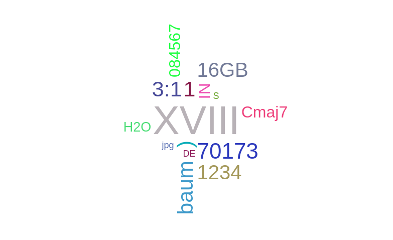
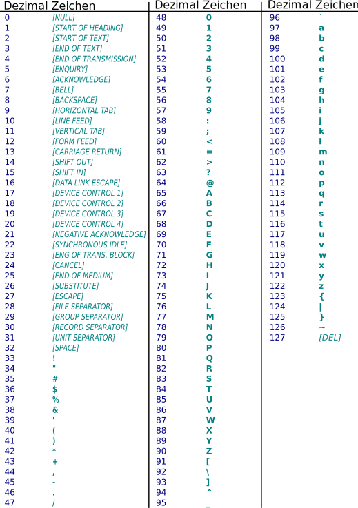

<!--
author:   Dirk Koehler

email:    koehler.di@gykl.lernsax.de

version:  0.0.1

language: de

narrator: DE Deutsch Male

comment:  Informatik Klasse 7

link:     https://cdn.jsdelivr.net/chartist.js/latest/chartist.min.css

script:   https://cdn.jsdelivr.net/chartist.js/latest/chartist.min.js

translation: Deutsch  translations/German.md

mode: Presentation

dark: false

@style

.lia-slide__footer {
    display: none !important;
}

.lia-effect__circle {
    display: none !important;
}

@media (min-width: 600px) {
    .newspaper {
        column-count: 2;
        column-gap: 40px;
        column-rule: 1px solid lightblue;
    }
}

h1, h2, h3, h4, h5, h6 {
    column-span: all;
    font-family: Arial, Helvetica, sans-serif;     
}

figurecaption {
    font-size: 0.8em;
    font-family: Arial, Helvetica, sans-serif;
    font-style: italic;
    font-weight: 600;
}

.kasten {
    background-color:rgba(162,67,8,0.8);    
    color:#FFFFFF;
    padding: 1em;
    margin: 1em 0em 1em 0em;
    border-radius:10px;    
    font-family: Arial, Helvetica, sans-serif;
    font-weight: 400;
}

.kasten0 {
    background-color:#399193;
    border-radius:10px;
    color:#FFFFFF;
    padding: 1em;
    font-family: Arial, Helvetica, sans-serif;
    font-weight:400;
}
.kasten1 {
    background-color:#A24308;
    border-radius:10px;
    color:#FFFFFF;
    padding: 1em;
    font-family: Arial, Helvetica, sans-serif;
    font-weight:400;
}

.cb {
    break-before: column;
}

@end

@onload
window.LIA.settings.font_size = 2
@end
-->
# Wissenschaft Informatik

Teilgebiete der Informatik
--------------------------

1. Theoretische Informatik
2. Praktische Informatik
3. Technische Informatik
4. Angewandte Informatik

# 1 Informationen und Daten

Aufgabe
-------

1. Erfrage eine Information über einen Mitschüler / eine Mitschülerin.
2. Finde verschiedene Darstellungsformen für diese Information.

## 1.1 Grundlegende Begriffe

Informationen
-------------

<div class="kasten">
Informationen stellen Kenntnisse über Sachverhalte oder Personen dar.
</div>

Daten
-----
<div class="kasten">
Daten sind die Elemente, die eine Information formal durch Symbole und Zeichen darstellen.
</div>

## 1.2 Zusammenhang zwischen Informationen und Daten

<!-- style="width: 60%; padding:10px;" -->
```ascii
            .---------------.
            | Informationen |
            .---------------.
                |      ^
      werden    |      |     werden
 dargestellt    |      |     interpretiert
         mit    |      |     zu
                V      |
            .---------------.
            |    Daten      |
            .---------------.
```

## 1.3 Daten interpretieren

Welche Informationen kannst du den folgenden Daten entnehmen?



## 1.4 Informationen darstellen

**Stelle folgende Informationen dar:**

<!-- style="width: 30%; float:right;padding:10px;" -->
``` ascii
+------------+
|0-DE-0353521|
+------------+
 ^  ^ |____|^
 |  |   ^   |
 |  |   |   +--Stallnummer 
 |  |   +------Betriebsnummer
 |  +----------Herkunftsland
 +-------------Haltungsform
```

- Ei aus sächsischer Freilandhaltung
- Betriebsnummer 6856
- Stallnummer 7

<!-- data-type="none" -->
|      Haltungsform       | Herkunftsland  |       Bundesland       |      Bundesland      |
|:-----------------------:|:--------------:|:----------------------:|:--------------------:|
| 0=ökologische Erzeugung | AT=Österreich  | 01=Schleswig-Holstein  |      09=Bayern       |
|    1=Freilandhaltung    |   BE=Belgien   |       02=Hamburg       |     10=Saarland      |
|     3=Bodenhaltung      | DE=Deutschland |    03=Niedersachsen    |      11=Berlin       |
|     4=Käfighaltung      |   IT=Italien   |       04=Bremen        |    12=Brandenburg    |
|                         | NL=Niederlande | 05=Nordrhein-Westfalen | 13=Mecklenburg-Vorp. |
|                         |   ES=Spanien   |       06=Hessen        |      14=Sachsen      |
|                         |                |   07=Rheinland-Pflaz   |  15=Sachsen-Anhalte  |
|                         |                |  08=Baden-Württemberg  |     16=Thüringen     |

## 1.5 Codierung

<div class="kasten">
Ein Code ist ein System von Regeln, das eine Zeichenkette in eine andere umwandelt. Codes werden meist dazu verwendet, um Information einfacher darstellen zu können.
</div>

### 1.5.1 ASCII-Code 

- Mit dem ASCII-Code (American Standard Code for Information Interchange) werden Zeichen Zahlen zugeordnet. 
- Der ASCII-Code umfasst 128  Zeichen und Zahlen von 0 bis 127. 

<figure style="margin:1em;">
    
<figurecaption>ASCII-Tabelle</figurecaption>
</figure>

### 1.5.2 Zahlen codieren

#### Dezimalsystem

Basis:          10

Zeichen:        0, 1, 2, 3, 4, 5, 6, 7, 8, 9

Schreibweise:   23871<sub>10</sub>

<!-- data-type="none" -->
|   10^6^ |  10^5^ | 10^4^ | 10^3^ | 10^2^ | 10^1^ | 10^0^ |
|--------:|-------:|------:|------:|------:|------:|------:|
| 1000000 | 100000 | 10000 |  1000 |   100 |    10 |     1 |

#### Binärsystem

Basis:          20

Zeichen:        0, 1

Schreibweise:   101010<sub>2</sub>

<!-- data-type="none" -->
| 2^6^ | 2^5^ | 2^4^ | 2^3^ | 2^2^ | 2^1^ | 2^0^ |
|-----:|-----:|-----:|-----:|-----:|-----:|-----:|
|   64 |   32 |   16 |    8 |    4 |    2 |    1 |

#### Hexadezimalsystem

Basis:          16

Zeichen:        0, 1, 2, 3, 4, 5, 6, 7, 8, 9, A, B, C, D, E, F

Schreibweise:   23871<sub>16</sub>

<!-- data-type="none" -->
| 16^2^ | 16^1^ | 16^0^ |
|------:|------:|------:|
|   256 |    16 |     1 |


## 1.6 Codierung von Bildern

> [Aufgabe](https://inf-schule.de/kids/datennetze/pixelgrafik)

> 1. Bearbeite die Lernstrecke Pixelgrafik einschließlich des Themas "Bildschärfe und Auflösung" und finde den Aufbau und die Eigenschaften von Pixelgrafiken heraus.
> 2. Bearbeite das Thema "Ein Bild mit Zahlen darstellen" und erläutere, wie Schwarz und Weiß in einer PBM-Pixelgrafik codiert werden. 

### 1.6.1 Pixelgrafik

<div class=kasten>
Eine Pixelgrafik auch Rastergrafik  bestehen aus einer rasterförmigen Anordnung sogenannter Pixel (Bildpunkte), denen jeweils eine Farbe zugeordnet ist. 
Merkmale sind  die Bildgröße (Bildauflösung) und Farbtiefe. 
</div>

### 1.6.2 PBM-Format "Portable Bitmap"

<!-- data-type="none" -->
| Zeile |  Inhalt  | Bedeutung                        |
|:-----:|:--------:|----------------------------------|
|   1   |    P1    | Grafikformat                     |
|   2   |   5 5    | Anzahl Spalten und Anzahl Zeilen |
| ab 3  | 0 oder 1 | Helligkeitswert                  |


### 1.6.3 PGM-Format "Portable Graymap"

<!-- data-type="none" -->
| Zeile |  Inhalt  | Bedeutung                        |
|:-----:|:--------:|----------------------------------|
|   1   |    P2    | Grafikformat                     |
|   2   |   5 5    | Anzahl Spalten und Anzahl Zeilen |
|   3   |    15    | maximaler Helligkeitswert        |
| ab 4  | 0 bis 15 | Helligkeitswert                  |

### 1.6.4 PPM-Format "Portable Pixmap"

<!-- data-type="none" -->
| Zeile |  Inhalt  | Bedeutung                        |
|:-----:|:--------:|----------------------------------|
|   1   |    P3    | Grafikformat                     |
|   2   |   5 5    | Anzahl Spalten und Anzahl Zeilen |
|   3   |    1     | maximaler Helligkeitswert        |
| ab 4  | 0 oder 1 | Helligkeitswert                  |

Ein Pixel wird mit drei Ziffern codiert. Jede Ziffer steht für die Farbe ***Rot Grün Blau***

### 1.6.5 RGB-Farbmodell

Das RGB-Farbmodell ist ein additives Farbmodell, bei dem die Farben Rot, Grün und Blau in verschiedenen Intensitäten gemischt werden.

<!-- data-type="none" style="font-family: monospace;"  -->
| R | G | B |         |
|:-:|:-:|:-:|:-------:|
| 1 | 0 | 0 | Rot     |
| 0 | 1 | 0 | Grün    |
| 0 | 0 | 1 | Blau    |
| 0 | 0 | 0 | Schwarz |
| 1 | 1 | 1 | Weiß    |
| 1 | 1 | 0 | Gelb    |
| 1 | 0 | 1 | Magenta |
| 0 | 1 | 1 | Cyan    |

> [Aufgabe](https://inf-schule.de/kids/datennetze/pixelgrafik/schritt8)

> Verändere den maximalen Helligkeitswert in der Grafik.
> Beschreibe deine Beobachtung.

## 1.7 Bits und Bytes

**Bit**
Ein Computer kann als Zusammenschluss von Millionen kleiner Schaltern betrachtet werden (an- oder ausgeschaltet).
Jeden einzelnen Schalterwert nennt ein Bit.
Ein Bit ist die kleinste Darstellungseinheit im Computer. 

**Byte**

``1 Byte = 1 Bit``

### 1.7.1 Binärpräfix

<!-- data-type="none" -->
|        |   |                                    |
|:-------|:--|-----------------------------------:|
|Kibibyte|KiB|1024 Byte=$2^{10}$ Byte             |
|Mebibyte|MiB|1.048.576 Byte=$2^{20}$ Byte        |
|Gibibyte|GiB|1.073.741.824 Byte=$2^{30}$ Byte    |
|Tebibyte|TiB|1.099.511.627.776 Byte=$2^{40}$ Byte|


### 1.7.2 Dezimalpräfix

<!-- data-type="none" -->
|        |   |                                    |
|:-------|:--|-----------------------------------:|
|Kilobyte|kB |1000 Byte=$10^{3}$ Byte             |
|Megabyte|MB |1000.000 Byte=$10^{6}$ Byte         |
|Gigabyte|GB |1000.000.000 Byte=$10^{9}$ Byte     |
|Terabyte|TB |1000.000.000.000 Byte=$10^{12}$ Byte|
